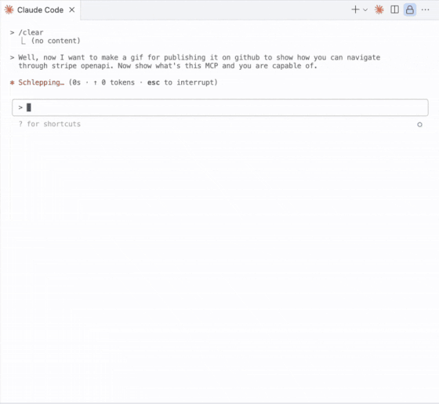

# OpenAPI MCP Server

An MCP server that provides tools for exploring large OpenAPI schemas without loading entire schemas into LLM context. Perfect for discovering and analyzing endpoints, data models, and API structure efficiently.

## Features

- **API Configuration Management**: Save and manage multiple API configurations with authentication headers if needed
- **Schema Caching**: Automatic caching of OpenAPI schemas to avoid repeated downloads
- **Endpoint Discovery**: List and search through API endpoints
- **Pagination Support**: Handle large APIs efficiently with configurable page sizes
- **Detailed Schema Exploration**: Get comprehensive information about endpoints and data models
- **Efficient Context Usage**: Explore large APIs without overwhelming LLM context windows

<div align="center">



</div>

## Prerequisites

- **Python 3.13+**: The server requires Python 3.13 or later
- **uv**: Fast Python package installer and resolver ([installation guide](https://docs.astral.sh/uv/getting-started/installation/))
- **MCP-compatible client**: Claude Desktop, Claude Code CLI, Cursor, or other MCP clients

### Installing uv

**macOS/Linux:**

```bash
curl -LsSf https://astral.sh/uv/install.sh | sh
```

**Using pip:**

```bash
pip install uv
```

## Installation

1. **Clone the repository:**

```bash
git clone https://github.com/nyudenkov/openapi-mcp-proxy.git
cd openapi-mcp-proxy
```

2. **Install dependencies:**

```bash
uv sync
```

3. **Verify installation:**

```bash
# Test that the server starts correctly
uv run python main.py
```

The server should start without errors.

## Usage

### Running the Server

```bash
uv run python main.py
```

The server runs using stdio and integrates with MCP-compatible LLM clients.

### Available Tools

#### API Management

- **`add_api`**: Add a new API configuration with name, URL and optional description
  - `name` (required): Short name for the API
  - `url` (required): URL to the OpenAPI scheme (yaml/json)
  - `description` (optional): Optional description
  - `headers` (optional): Optional HTTP headers for authentication (e.g., {'Authorization': 'Bearer token', 'X-API-Key': 'key'})

- **`list_saved_apis`**: List all saved API configurations

- **`remove_api`**: Remove a saved API configuration

#### API Exploration

- **`get_api_info`**: Get general information about an API

- **`list_endpoints`**: List all endpoints in an API with pagination and filtering

- **`search_endpoints`**: Search endpoints by query with pagination and filtering

- **`get_endpoint_details`**: Get detailed information about a specific endpoint

- **`list_models`**: List all data models in an API with pagination and filtering

- **`get_model_schema`**: Get detailed schema for a specific model

### Tools Capabilities

#### Pagination

All listing tools (`list_endpoints`, `search_endpoints`, `list_models`) support pagination to handle large APIs efficiently:

- Default page size: 50 items
- Responses include navigation information (current page, total pages, has next/previous)

#### Advanced Filtering

Tools are capable to filter results to find exactly what you need:

**Endpoint Filtering:**

- HTTP methods (GET, POST, PUT, DELETE, etc.)
- Tags (include/exclude specific tags)
- Authentication requirements
- Deprecation status

**Model Filtering:**

- Model types (object, array, string, etc.)
- Property count (min/max number of properties)
- Required fields presence
- Tags (include/exclude specific tags)

## Configuration

API configurations are automatically saved to `api_configs.json` in the working directory. The file structure:

```json
{
  "apis": {
    "api-name": {
      "name": "some-project-local-backend",
      "url": "http://127.0.0.1:8000/openapi.json",
      "description": "Optional description for some cool project local backend scheme"
    },
    "api-name": {
      "name": "stripe-yaml",
      "url": "https://raw.githubusercontent.com/stripe/openapi/refs/heads/master/openapi/spec3.yaml",
      "description": "Stripe YAML OpenAPI scheme"
    }
  }
}
```
